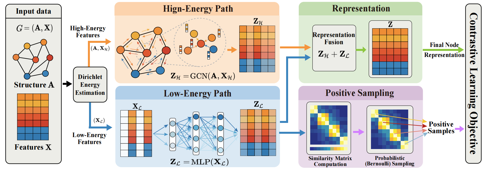
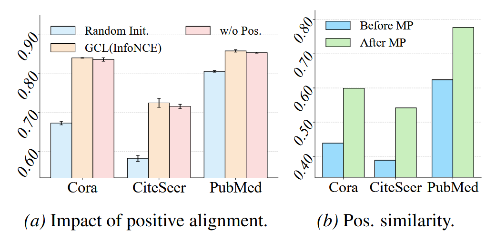

<h1 align="center">Revisiting Positive Samples in Graph Contrastive Learning:  
From the Perspective of Message Passing</h1>

<div align="center">

International Conference on Machine Learning (ICML) 2026

[[Paper]](https://openreview.net/forum?id=YkUsqcPYkU) &nbsp; • &nbsp;
[[Code]](https://github.com/hedongxiao-tju/SPGCL)

[](#)
[](https://www.python.org/)
[](https://pytorch.org/)
[](https://www.pyg.org/)
[](LICENSE)

</div>

<p align="center">
  
</p>

> **SPGCL** revisits the role of positive samples in Graph Contrastive Learning from the perspective of GNN message passing.  
> We reveal the **pre-alignment effect**, where message passing makes positive samples similar before contrastive optimization, and propose **energy-aware propagation** and **energy-guided positive sampling** to restore effective positive learning.

---

## 📚 Table of Contents

1. [Overview](#overview)
2. [Motivation](#motivation)
3. [Method](#method)
4. [Installation](#installation)
5. [Dataset Preparation](#dataset-preparation)
6. [Quick Start](#quick-start)
7. [Main Results](#main-results)
8. [Ablation Study](#ablation-study)
9. [Repository Structure](#repository-structure)
10. [Citation](#citation)
11. [Acknowledgement](#acknowledgement)
12. [Contact](#contact)

---

## ✅ TODO

- [x] Release the core implementation of SPGCL
- [x] Release scripts for homophilic graph benchmarks
- [x] Release scripts for heterophilic graph benchmarks
- [x] Release node clustering evaluation protocol
- [x] Release full hyper-parameter logs
- [ ] Release poster and slides

---

## Overview

Graph Contrastive Learning (GCL) has become a mainstream graph self-supervised learning paradigm. Most existing GCL methods rely on positive samples, assuming that aligning positive pairs helps graph encoders learn invariant semantic and structural patterns.

However, we observe a counterintuitive phenomenon: **GCL can still achieve competitive performance even when the positive alignment term is removed**. This motivates us to ask:

- Why do positive samples fail to provide substantial performance gains in some GCL models?
- What prevents GCL from effectively learning from positive samples?
- How can we restore the learning efficacy of positive samples?

We find that **GNN message passing itself can increase the similarity between positive samples before contrastive optimization**. We define this phenomenon the **pre-alignment effect**. It makes positive samples appear close even before being optimized by the contrastive objective, thereby weakening the useful learning signal carried by positive alignment.

To address this issue, we propose **Separate Propagation Graph Contrastive Learning (SPGCL)**, which separates feature propagation according to feature-wise Dirichlet energy and constructs reliable positive samples with energy-guided sampling.

---

## Motivation

<p align="center">
  
</p>

Positive samples are widely regarded as essential in graph contrastive learning. Ideally, positive alignment should help graph encoders capture semantic invariance under perturbations.

Nevertheless, our motivation experiments show that removing positive samples from the InfoNCE objective can still lead to competitive performance. Meanwhile, the similarity between positive pairs increases significantly after GNN message passing.

This suggests that positive samples may have been **trivially pre-aligned** by message passing, rather than effectively learned through the contrastive objective.

---

## Method

SPGCL contains two key components:

### 1. Energy-Aware Propagation, EAP

We estimate the **Dirichlet energy** of each feature dimension and divide node features into high-energy and low-energy parts.

- **High-energy features** preserve informative local variations and are propagated through a GCN encoder.
- **Low-energy features** are smooth over the graph and tend to amplify redundant similarity. They are therefore transformed by an MLP without graph propagation.

### 2. Energy-Guided Positive Sampling, EPS

Although low-energy features contribute little to effective positive alignment, they encode stable and smooth graph signals. SPGCL uses them to construct a probabilistic positive sampling matrix. This helps filter unreliable positive pairs and is especially useful on heterophilic graphs, where neighboring nodes may belong to different classes.

---

## Installation

We recommend creating a clean conda environment.

```bash
conda create -n spgcl python=3.8
conda activate spgcl
```

Install PyTorch according to your CUDA version from the official website:

```bash
# Example for CUDA 11.7. Please modify this command according to your environment.
pip install torch torchvision torchaudio --index-url https://download.pytorch.org/whl/cu117
```

Install PyTorch Geometric and other dependencies:

```bash
pip install torch_geometric
pip install -r requirements.txt
```

Clone this repository:

```bash
git clone https://github.com/hedongxiao-tju/SPGCL.git
cd SPGCL
```

---

## Dataset Preparation

SPGCL is evaluated on 12 commonly used graph benchmarks.

| Setting | Datasets |
|:--|:--|
| Homophilic graphs | Cora, CiteSeer, PubMed, Photo, Computers, CS |
| Heterophilic graphs | Chameleon, Cornell, Texas, Wisconsin, Crocodile, Actor |

Most datasets can be automatically downloaded through PyTorch Geometric. If automatic downloading fails, please manually place the datasets under:

```text
SPGCL/
└── data/
    ├── Cora/
    ├── CiteSeer/
    ├── PubMed/
    └── ...
```

---

## Quick Start

### Train SPGCL on homophilic graphs

```bash
python model_homo/node_classification_homo.py
```

### Train SPGCL on heterophilic graphs

```bash
python model_heter/node_classification_heter.py
```

### Node clustering evaluation

```bash
python model_homo/node_clustering.py
```

## Main Results

### Node classification on homophilic graphs

| Method | Cora | CiteSeer | PubMed | Photo | CS | Computers |
|:--|--:|--:|--:|--:|--:|--:|
| SPGCL | **85.44 ± 0.13** | **73.49 ± 0.26** | **87.19 ± 0.13** | **94.83 ± 0.07** | **95.03 ± 0.03** | **91.04 ± 0.09** |

### Node classification on heterophilic graphs

| Method | Chameleon | Cornell | Texas | Wisconsin | Crocodile | Actor |
|:--|--:|--:|--:|--:|--:|--:|
| SPGCL | **72.26 ± 1.66** | **75.41 ± 6.43** | **80.81 ± 6.30** | **83.53 ± 4.26** | **77.43 ± 0.67** | **37.23 ± 1.19** |

### Node clustering

| Dataset | NMI | Homogeneity |
|:--|--:|--:|
| Computers | **0.5626** | **0.6132** |
| Photo | **0.7135** | **0.7251** |
| CS | **0.8046** | **0.8345** |

---

## Ablation Study

We evaluate the contribution of Energy-Aware Propagation (EAP) and Energy-Guided Positive Sampling (EPS).

| Variant | Cora | Photo | CS | Cornell | Texas | Actor |
|:--|--:|--:|--:|--:|--:|--:|
| SPGCL | **85.44** | **94.83** | **95.03** | **75.41** | **80.81** | **37.23** |
| w/o EAP | 84.10 | 93.21 | 92.99 | 50.27 | 68.91 | 24.86 |
| w/o EPS | 84.91 | 93.99 | 94.67 | 66.76 | 78.65 | 35.00 |
| w/o EAP & EPS | 83.70 | 93.73 | 93.67 | 50.08 | 66.76 | 23.33 |


---

## Repository Structure

```text
SPGCL/
├── img/                     # Images
├── data/                    # Downloaded graph datasets
├── model_homo/              # Code for homophilic graph
│   ├── log_clustering/
│   ├── node_clustering.py
│   ├── node_clustering
│   ├── log_classification_homo/
│   ├── node_classification_homo.py
│   └── node_classification_homo
├── model_heter/             # Code for heterophilic graph
│   ├── models.py     
│   ├── layers.py
│   ├── utils.py
│   ├── dataset.py
│   ├── log_classification_heter/
│   ├── node_classification_heter.py
│   └── node_classification_heter
├── requirements.txt
└── README.md
```

---

## Citation

If you find this repository useful, please consider citing our paper:

```bibtex
@inproceedings{shan2026revisiting,
  title     = {Revisiting Positive Samples in Graph Contrastive Learning: From the Perspective of Message Passing},
  author    = {Shan, Lianze and Wang, Ningchong and Zhao, Jitao and Jin, Di and He, Dongxiao},
  booktitle = {Proceedings of the 43rd International Conference on Machine Learning},
  year      = {2026}
}
```

---

## Acknowledgement

We thank the open-source graph learning community for providing high-quality implementations and benchmark datasets.

We sincerely thank the authors of **GraphACL** for their excellent work and open-source implementation. The code for our heterophilic graph experiments is built upon their implementation, and we greatly appreciate their contribution to the graph learning community.

---

## Contact

For questions or discussions, please feel free to open an issue or contact:

- **Lianze Shan**: shanlz2119@tju.edu.cn

- **Dongxiao He**: hedongxiao@tju.edu.cn

---

## License

This project is released under the MIT License. See [LICENSE](LICENSE) for details.
